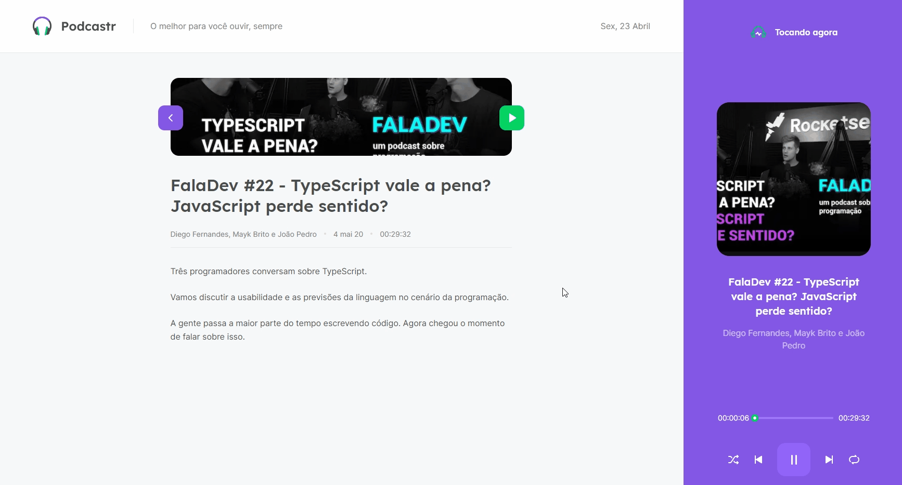

<h1 align="center">
    
</h1>

<div align="center">
    <h3> 🎶 O melhor para você ouvir, sempre. 🎶 </h3>
    <a href="https://rocketseat.com.br/" target="_blank">
      
    </a>
    <a href="https://github.com/PedroCantanhede" target="_blank">
      
    </a>
     
    
    
</div>

# Podcastr

Aplicação realizada na NLW 5 (Next Level Week 5) da Rocketseat com intuito de gerenciar seus podcasts. Desenvolvida com ReactJS e NextJS consumindo uma API Fake para obter os dados do podcast.

<div align="center" >
  
</div>

# :hammer: Tecnologias

💻 HTML

💻 SASS

💻 ReactJS

💻 NextJS

💻 NodeJS

💻 Typescript

💻 Javascript

### :gear: Dependências

✔ JSON Server
✔ Yarn ou NPM
✔ Axios

## :camera: Veja:

### Aplicação




### Código:


## :rocket: Instalação

```bash
# Clone o repositório
$ git clone https://github.com/PedroCantanhede/Podcastr.git

# Entre na pasta do projeto
$ cd podcastr

# Instale as dependências
$ npm install / yarn install

# Execute a aplicação
$ npm run dev / yarn dev

# Abra o projeto na porta: 3000 - acessando: http://localhost:3000
```

## :infinity: Ajuda da Rocketseat

A ajuda das aulas disponibilizadas durante a semana da NLW foi essencial para que eu chegasse no final do projeto. Deixo meus agradecimentos ao professor **Diego Fernandes**.
[Venha e participe da próxima NLW!!!](https://discord.gg/YxU7fJT)
